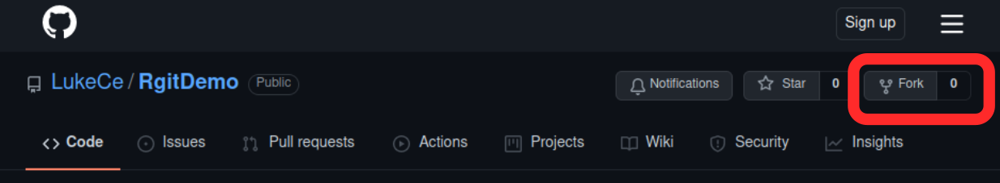

```{r, include = FALSE}
knitr::opts_chunk$set(
  collapse = TRUE,
  comment = "#>"
)
```

```{r setup, eval=FALSE}
library("tinytest")
library("usethis")
```


## Setup your Project on GitHub

### Quickstart

```{r, eval=FALSE}
# 0) optionally write default settings into your R profile
usethis::edit_r_profile()
usethis::edit_r_environ()

# 1) create this project
usethis::create_package("/Projects/Packages/RgitDemo")

# 2) initialize git and gitHub
usethis::use_github()

# 3) create your first function and vignette
usethis::use_r("utils_list.R")
usethis::use_vignette("Quickstart_R_package_on_gitHub", title = "Quickstart guide for creating an R package on gitHub")

# 4) invite your collaborators to fork your repo and start working together.
```

### Some explanations


**Prerequisites**:  
Before starting you should create an account on [GitHub](https://github.com/) and download the [latest version of R](https://cran.r-project.org/) and the [RStudio IDE](https://www.rstudio.com/products/rstudio/download/).
If you are using windows you also have to install [Rtools](https://cran.r-project.org/bin/windows/Rtools/) for building packages.

**In step 0** we may set some default values:  
We can write the default settings to the user level .Renviron and .Rprofile files.

In the .Renviron file we place a GitHub token that allows us to create GitHub repositories from within RStudio.
If you do not have already a GitHub token create it with `usethis::create_github_token()` and than copy and paste into the .Renviron file, which you can easily access by typing `usethis::edit_r_environ("user")`.

```{bash}
# Contents of the .Renviron file
GITHUB_PAT='paste_your_token_here'
```

In the .Rprofile file we can set some options that speed up the creation of new packages.
It is most easily accessed by typing `usethis::edit_r_profile("user")` and can be understood as an Rscript that is automatically sourced whenever you start RStudio.

```{r, eval=FALSE}
# Contents of the .Rprofile file 
options(
    usethis.full_name = "Lukas Dargel",
    usethis.protocol  = "ssh",
    usethis.description = list(
        "Authors@R" = c(utils::person(
            given = "Lukas",
            family = "Dargel",
            email = "lukas.dargel@mailbox.org",
            role = c("aut", "cre"),
            comment = c(ORCID = "0000-0002-4839-506X")
        )),
        Version = "0.0.0.9000"
    ),
    usethis.destdir = "your/favourite/package/location",
)
```

**In step 1** we create a minimal R package based on RStudio projects:  
The minimal package contains 4 files and one directory;
+ .Rbuildignore is a file that lists the objects that should be ignored when building the package (by default the RStudio related files are ignored because they are not permitted inside an R package).
+ DESCRITOPN contains information about the package, its code dependencies and its authors. It is filled with the default you set in the .Rprofile file.
+ NAMESPACE contains the list of exported function from your package (it is empty at first)
+ RgitDemo.Rproj is a file linked read only by the RStudio and has nothing todo with R packages
+ the R directory is empty at first but it will contain all R-scripts that contain the functions and object in your package (sub directories are not permitted). 


**In step 2** we initialize git and GitHub:  
In this step we start to version control the r package directory and link it to a remote repository on GitHub.
We can do this using the single command `usethis::use_github()` which executes the following three steps.
+ initialize a local git repository `git init`
+ create a remote repository on GitHub (for this step you need the access token in step 0, otherwise you can create the repository manually)
+ add the GitHub repository as a remote to your project `git remote set-url origin git@github.com:LukeCe/RgitDemo.git`
+ push your local files to the remote repository `git push origin master`

At this stage I want to point out that GitHub supports two communication protocols, namely https and ssh.
Both of them ensure that your data is encrypted when it is being sent to or downloaded from the remote repository.
In this example I chose the ssh protocol by setting the `options(usethis.protocol  = "ssh")` inside the .Rprofile file.
This requires to setup a pair of ssh keys on your local machine and to [upload the public key to GitHub](https://docs.github.com/en/authentication/connecting-to-github-with-ssh/adding-a-new-ssh-key-to-your-github-account).
Alternatively you can use the https protocol which requires to use an acces token (like the one in Step 0).
You can add the token to RStudio by calling `gitcreds::gitcreds_set()` and pasting it into the command prompt. 

Once your connection is set you can use the RStudio IDE to exchange code between the local project and the remote repository on GitHub.
It is also easy to change between the different protocols using the following commands in the terminal.

```{bash}
# check which remote you are using
git remote -v

# to change from https to ssh use
git remote set-url origin git@github.com:LukeCe/RgitDemo.git

# to change from ssh to https use
git remote set-url origin https://github.com/LukeCe/RgitDemo.git
```


**In step 3** we create our first contributions to the project:  
For this example I chose to add a simple R function and the vignette you are currently reading.
After the changes ready you can commit them to your project and push them to the remote so that they become visible to everyone.
This can easily be done by using the Git pane in the RStudio IDE.

**From Step 4 onward** we start to develop the project collectively:  
In the previous step I committed my changes directly to the master branch, which is okay as long as I am the only developer on the project.
However, as soon as there are multiple contributors it is recommended not to make any changes directly on the master/main branch.
Instead we use branches and forks to develop new functionality and merge them into the main branch via pull requests, which are explained in the next section.

## Start collaborative development

Before going into the technical details of how to work on joint project I want to share my opinion on what the original (or upstream) repository of such a project represents.
This will hopefully clarify why the maintainers are (or should be) careful about the code changes that that affect it.

The master or main branch of the upstream repository corresponds to the development version of the code.
This version is available to users who want to experiment with new functionality and if are kind enough they may share their experience with the authors.
It is also the point of reference for all new and existing contributors, meaning that only code that is in harmony with the latest version of the upstream master can be added to the project.
Although the development version does usually not grantee stability, it should have high quality standards.
For this reason direct commits to the master branch are discouraged.
Instead, the contributors to a project develop their functionality in a different branch.
Only when the implementation of the new feature is satisfactory they make a pull request, which invites the maintainers to merge their contribution into the main branch.

The pull request workflow has the advantage that maintainers can easily review the new code and handle the merge directly in GitHub.
In case of merge conflicts the maintainer and contributor is notified and they can decide how to resolve them.
In most cases the contributor is asked to revise their code until the merge can proceed without conflicts.

### Start to contribute to a collaborative project

1. Fork the original repository (called upstream) on using your own GitHub account.

{ width=100% }


2. Clone the fork into your local environment
Either use the terminal `git clone git@github.com:<YOUR_GITHUB>/RgitDemo.git` 
Or use the RStudio IDE using file > New Project > Version control > Give url ([more detailled instructions are here](https://happygitwithr.com/existing-github-first.html#existing-github-first))

3. Create a branch for your feature and push the branch to your fork
This cane be done via the git pane in RStudio

4. Once the feature is ready open a pull request on github inviting the maintainer to copy your branch on merge it into hist master


### Some explanations

A fork is 


### A note for the maintainer


As a maintainer you can either fork your own repository and use the same model as for contributors or you develop directly on a branch of the original repository.

The maintainer of a project can choose the same model for contributing to the project as any other contributor.
In this he has to fork his own repository which is not directly supported by github.
We can work around this creating a second account or by replacing the first two steps in above workflow by the following five:

+ Create an empty github repository e.g. RgitDemo_fork
+ Clone this repository `git clone git@github.com:LukeCe/RgitDemo_fork`
+ Add the original repository as an upstream `git remote add upstream git@github.com:LukeCe/RgitDemo`
+ Pull the master branch from upstream `git pull upstream master`
+ Push the master branch to your fork `git push origin master`


Alternatively the maintainer can continue to develop in the original repository.
In any case new features should be developed in branches and not directly on the master.
Once the feature is ready it can either be merged locally or pushed to github and merged via a pull request.
One disadvantage of this model is that the upstream repository may have multiple branches which may be confusing for new contributors and users interested in the development version of the software.


## Automation of tasks

### Building the package website

```{r, eval=FALSE}
usethis::use_pkgdown_github_pages()
usethis::use_github_action("pkgdown")
```

### R CMD check

### Unit testing


## Additional resources

**On R packages:**

- https://cran.r-project.org/doc/manuals/r-release/R-exts.html
- https://r-pkgs.org/
- https://www.tinyverse.org/

**On git:**

- https://happygitwithr.com/
- https://pandammonium.org/how-to-change-a-git-repository-from-https-to-ssh/
- https://deanmalone.net/post/how-to-fork-your-own-repo-on-github/
